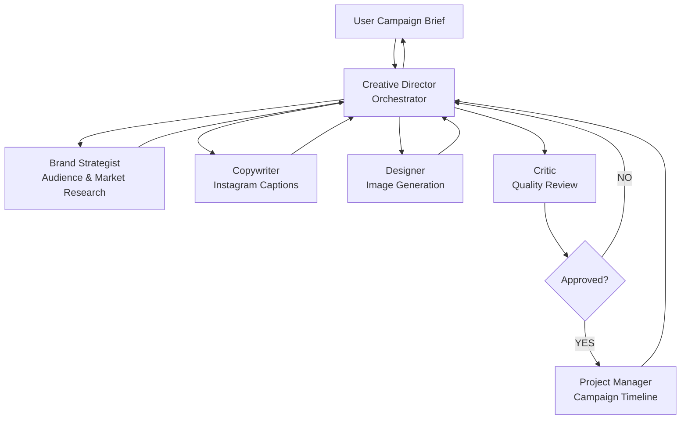
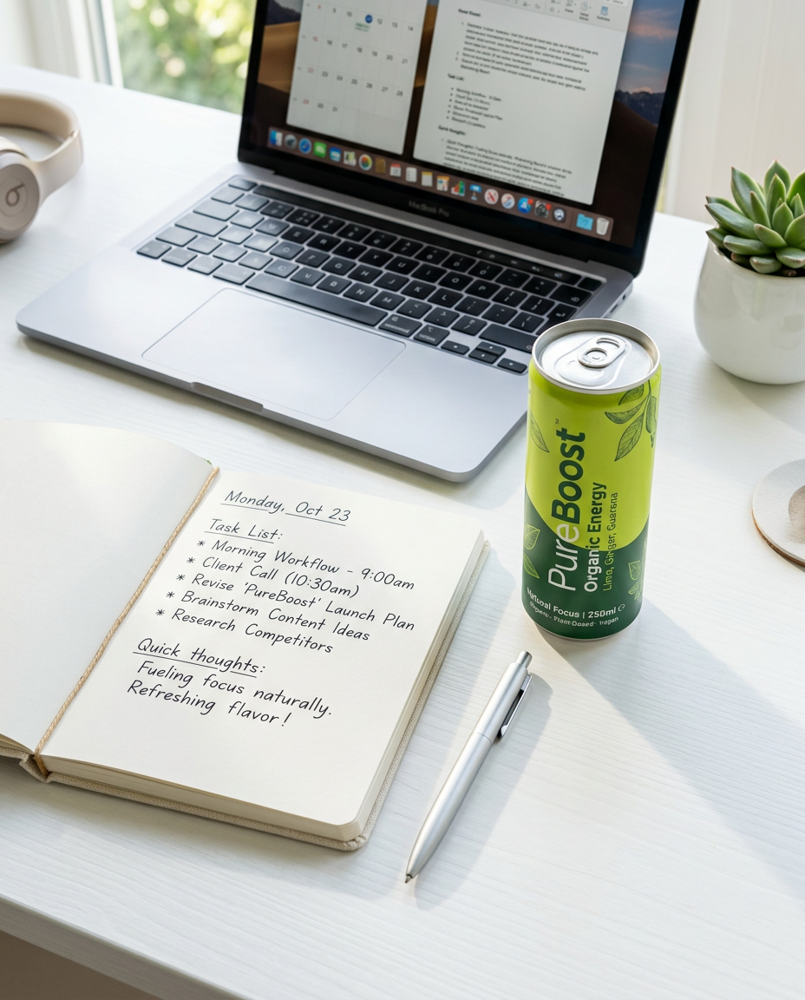
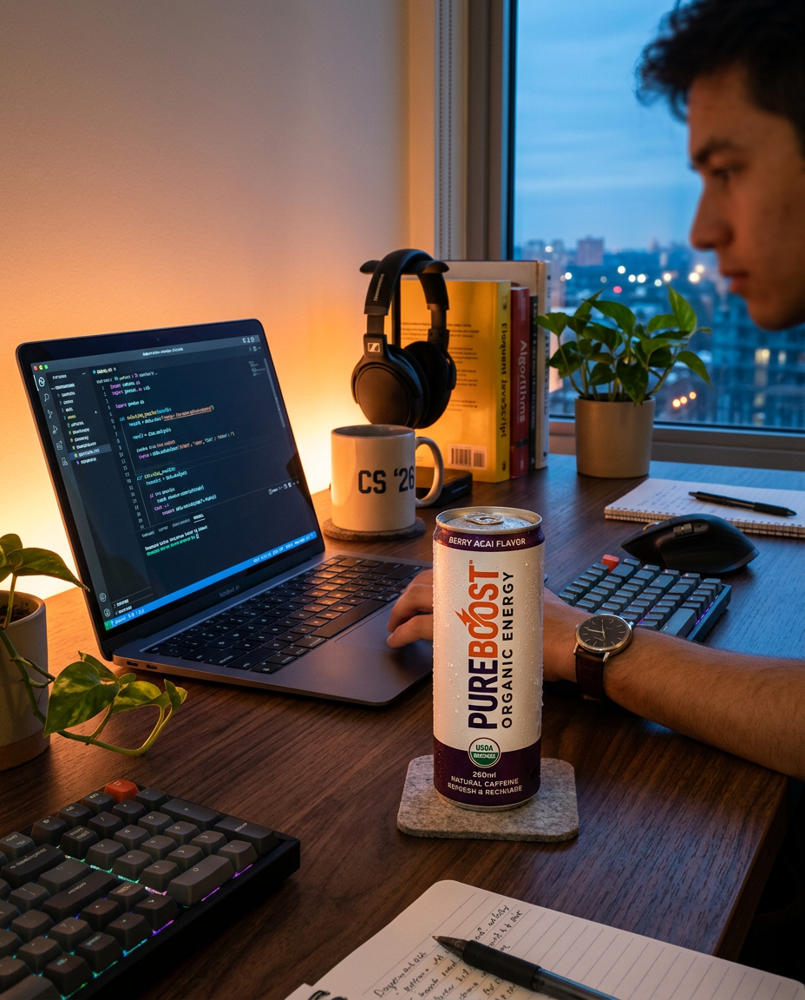
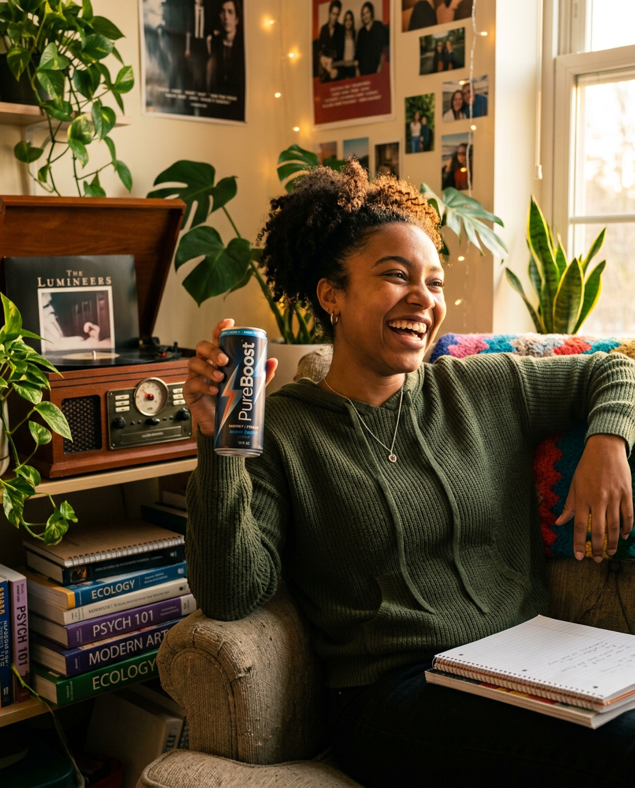
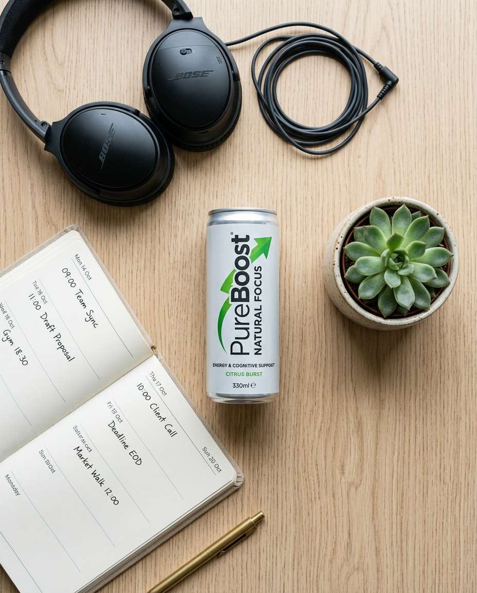
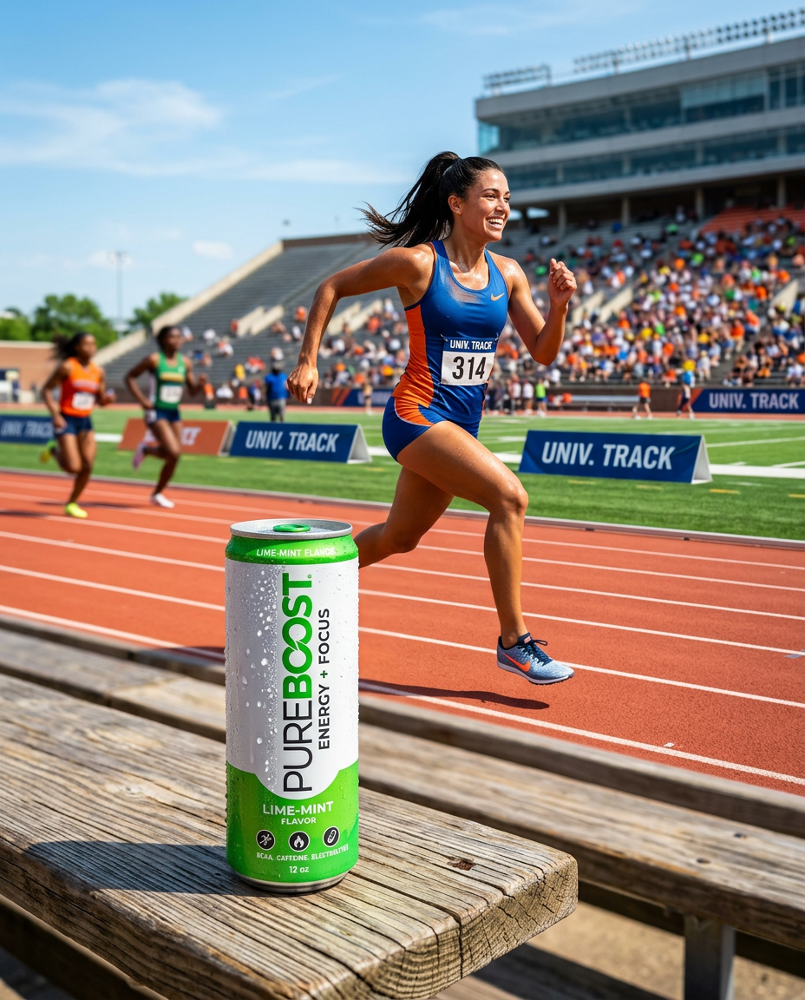
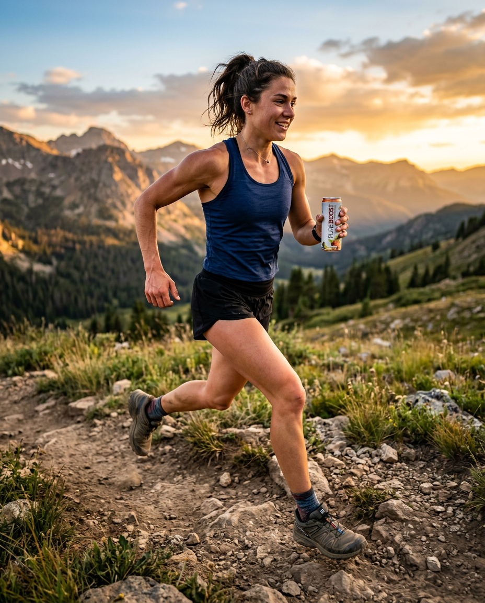

# AI Creative Studio – Multi-Agent Instagram Campaign Generation

## Overview

I built a distributed, multimodal **Multi-Agent Creative Studio** that transforms a simple campaign brief into a complete Instagram campaign.

The system uses **Google Agent Development Kit (ADK)**, **Agent-to-Agent (A2A) communication**, **Model Context Protocol (MCP)**, Gemini models, Google Cloud Run, and Gemini Enterprise Agent Platform Runtime.

Instead of relying on a single agent to perform every task, I designed the solution as a team of specialized AI agents. Each agent has a clearly defined responsibility and runs as an independent service.

The **Creative Director** acts as the orchestrator, coordinating the specialist agents and carrying context through the entire campaign workflow.

---

## Architecture

The solution consists of six specialized agents:

| Agent | Platform | Responsibility |
|---|---|---|
| Brand Strategist | Cloud Run | Researches target audiences, competitors, market trends, and strategic insights using Google Search |
| Copywriter | Cloud Run | Creates three Instagram caption variations using reusable ADK Skills |
| Designer | Cloud Run | Creates visual concepts and generates real campaign images using Gemini |
| Critic | Cloud Run | Reviews captions and generated visuals and provides structured quality feedback |
| Project Manager | Cloud Run | Creates the campaign timeline and tasks, with optional Notion integration through MCP |
| Creative Director | Gemini Enterprise Agent Platform Runtime | Orchestrates the complete workflow and communicates with specialist agents over A2A |

Each specialist is independently deployed and exposed through an **A2A agent interface**. The Creative Director discovers and invokes these agents remotely rather than embedding their implementation directly into the orchestrator.

---

## Multi-Agent Workflow

A user provides a single campaign brief to the Creative Director.

The Creative Director then coordinates the complete campaign generation process:



The high-level execution flow is:

1. **Campaign Brief** – The user provides the campaign idea and target audience.
2. **Research** – The Brand Strategist researches the audience, competitors, and current market trends.
3. **Copy Generation** – The Copywriter uses the research to generate three distinct Instagram captions.
4. **Visual Generation** – The Designer creates matching visual concepts and generates real campaign images.
5. **Quality Review** – The Critic evaluates both the captions and generated images.
6. **Revision Loop** – If the Critic returns `NEEDS_REVISION`, the Creative Director routes the feedback back to the appropriate specialist and requests another review.
7. **Campaign Planning** – After the configured review/revision process completes, the Project Manager creates the campaign timeline and task plan.
8. **Final Campaign** – The Creative Director assembles the research, captions, images, review results, and project plan into the final response.

---

## Agent-to-Agent (A2A) Architecture

One of the key parts of this project is that the specialist agents are **not Python functions running inside the Creative Director application**.

Each specialist runs as an independent service with its own endpoint. The Creative Director communicates with them using the **A2A protocol**.

```text
                         User
                           │
                           ▼
                 ┌─────────────────┐
                 │ Creative        │
                 │ Director        │
                 │ Orchestrator    │
                 └────────┬────────┘
                          │
                          │ A2A
          ┌───────────────┼────────────────┐
          │               │                │
          ▼               ▼                ▼
   Brand Strategist   Copywriter       Designer
     Cloud Run        Cloud Run        Cloud Run
          │               │                │
          └───────────────┼────────────────┘
                          │
                          │ A2A
                    ┌─────┴─────┐
                    ▼           ▼
                  Critic    Project Manager
                Cloud Run      Cloud Run
```

This distributed design allows each agent to be developed, deployed, updated, and scaled independently.

---

## Brand Strategist

The Brand Strategist is responsible exclusively for **research and strategy**.

I configured this agent to:

- Research the target audience using Google Search
- Identify audience demographics, behaviors, interests, needs, and pain points
- Analyze relevant competitors
- Research current market trends
- Produce strategic insights for downstream agents
- Keep research current by incorporating the current year into search queries

The Brand Strategist intentionally does **not** generate captions or visual designs. Its output becomes the research foundation for the rest of the campaign.

---

## Copywriter

The Copywriter receives the Brand Strategist's research and transforms it into Instagram-ready content.

The agent generates:

- Three distinct caption variations
- Different tones and messaging approaches
- Strong opening hooks
- Calls to action
- Relevant hashtags

I also integrated **ADK Skills** so reusable copywriting knowledge can be maintained separately from the agent's primary system instructions.

This keeps reusable expertise modular instead of placing every copywriting rule inside one large prompt.

---

## Designer

The Designer converts campaign concepts into actual visual assets.

The Designer uses a tool-based architecture where the text agent creates the image concept and prompt, while a separate Gemini image model performs the image generation.

The generated images are uploaded to **Google Cloud Storage**, and the Designer returns the corresponding `gcs_uri`.

```text
Designer Agent
      │
      ▼
Creates image concept + prompt
      │
      ▼
Image Generation Tool
      │
      ▼
Gemini Image Model
      │
      ▼
Generated Image
      │
      ▼
Google Cloud Storage
      │
      ▼
gcs_uri
```

This allows downstream agents, particularly the Critic, to access the generated visual without passing large raw image payloads between agents.

---

## Critic and Quality Gate

The Critic acts as the automated quality-control layer of the system.

It reviews:

- Instagram copy
- Generated campaign visuals
- Alignment between the campaign strategy, copy, and visual content

The Critic produces a structured verdict such as:

```text
APPROVED
```

or:

```text
NEEDS_REVISION
```

When revisions are required, the Critic identifies the most important issue that needs to be corrected.

The Creative Director uses this result to determine whether work should be sent back to the appropriate specialist for revision.

---

## Automatic Revision Loop

A major feature I implemented is an automated quality and revision loop.

```text
             Copy + Images
                   │
                   ▼
                Critic
                   │
                   ▼
          ┌─────────────────┐
          │     Verdict     │
          └────────┬────────┘
                   │
          ┌────────┴─────────┐
          │                  │
      APPROVED        NEEDS_REVISION
          │                  │
          ▼                  ▼
 Project Manager      Creative Director
                             │
                             ▼
                   Appropriate Specialist
                             │
                             ▼
                           Critic
```

When the Critic returns `NEEDS_REVISION`, the Creative Director interprets the feedback and routes it to the appropriate specialist. Revised work is then returned to the Critic for another review.

The workflow uses a configured revision limit so it does not enter an uncontrolled regeneration loop.

---

## Project Manager and MCP

After the quality-review stage, the Project Manager converts the campaign into an actionable execution plan.

The Project Manager generates:

- Campaign timeline
- Tasks
- Deliverables
- Execution plan

I also support optional **Notion integration using Model Context Protocol (MCP)**.

MCP allows the Project Manager to interact with Notion through a standardized tool interface rather than implementing a custom Notion integration directly inside the agent.

The Project Manager still generates the complete text-based campaign plan when Notion is unavailable.

---

# End-to-End Campaign Demo

The following is an actual end-to-end run of the Multi-Agent Creative Studio. A single campaign brief was submitted through the Google ADK development UI, and the Creative Director autonomously coordinated the specialist agents through research, copywriting, image generation, quality review, revision, and project planning.

## 1. Initial Campaign Brief

> **Create a complete Instagram campaign for PureBoost, a new organic energy drink made with natural ingredients and no artificial sweeteners.**
>
> Target audience: U.S. college students ages 18–24 who want sustained energy for studying, classes, workouts, and social activities.
>
> Campaign goal: Build brand awareness and encourage students to try PureBoost.
>
> Brand personality: Energetic, authentic, modern, healthy, and environmentally conscious.
>
> Create the complete campaign, including market research, 3 Instagram posts, matching generated visuals, quality review, revisions if required by the Critic, and a project timeline.
>
> Work through the entire workflow autonomously without asking me for approval between steps.

[View the complete initial campaign brief](assets/demo/initial-prompt.md)

---

## 2. Autonomous Multi-Agent Execution

The Creative Director decomposed the brief and coordinated the complete workflow:

```text
Campaign Brief
      │
      ▼
Creative Director
      │
      ▼
Brand Strategist
      │
      │ Market & Audience Research
      ▼
Copywriter
      │
      │ 3 Instagram Posts
      ▼
Designer
      │
      │ Initial Visuals (V1)
      ▼
Critic
      │
      │ Copy: 9/10 — APPROVED
      │ Visuals: 6/10 — NEEDS_REVISION
      ▼
Creative Director
      │
      │ Routes visual feedback
      ▼
Designer
      │
      │ Revised Visuals (V2)
      ▼
Critic
      │
      │ Final Quality Review
      ▼
Project Manager
      │
      ▼
Final Campaign Package
```

The Critic approved the copy but identified visual issues including a spelling error, anatomical distortion, and AI-generated artifacts. The Creative Director therefore preserved the approved copy and routed the visual feedback specifically back to the Designer.

[View the detailed multi-agent execution trace](assets/demo/agent-conversation.md)

---

## 3. Critic-Driven Revision

The initial quality review produced:

- **Copy:** `9/10 — APPROVED`
- **Visuals:** `6/10 — NEEDS_REVISION`

The Designer generated a second set of visuals based on the Critic's feedback.

### The Modern Desk

| Initial Generation (V1) | After Critic Feedback (V2) |
|---|---|
|  |  |

### Mindful Productivity

| Initial Generation (V1) | After Critic Feedback (V2) |
|---|---|
|  |  |

### The Natural Peak

| Initial Generation (V1) | After Critic Feedback (V2) |
|---|---|
|  |  |

The revised assets were automatically returned to the Critic for another quality review.

The final review continued to identify some technical AI artifacts in the revised visuals. Because the workflow was configured for a maximum of one revision round, the Creative Director preserved the Critic's final assessment and proceeded to project planning instead of entering an uncontrolled revision loop.

---

## 4. Final Campaign Output

The final PureBoost campaign package contained:

- Market research and **"Modern Organic"** campaign positioning
- Target audience insights for U.S. college students ages 18–24
- Three Instagram posts with captions and hashtags
- Three generated and revised campaign visuals
- Critic quality assessment
- Four-week implementation timeline
- Campaign budget estimate

During final packaging, HTTPS image-link generation encountered a technical issue. The generated assets remained available through their Google Cloud Storage URIs, and the workflow continued to produce the final campaign summary and project plan.

[View the complete final campaign output](assets/demo/final-output.md)

---

## 5. What the Demo Demonstrates

This end-to-end run demonstrates:

- **Autonomous orchestration** from a single user brief
- **Specialized agents** for research, copywriting, design, evaluation, and planning
- **A2A communication** between the Creative Director and remote specialist agents
- **Context propagation** from research to copy to visual generation
- **Independent quality evaluation** through the Critic
- **Targeted revision routing** based on Critic feedback
- **Controlled iteration** through a configured revision limit
- **Graceful handling of a non-critical failure** during HTTPS image-link generation
- **Transparent quality reporting** when the Critic continued to identify visual artifacts after revision

The detailed execution trace and final campaign output are preserved in the repository so the complete workflow can be inspected rather than inferred only from the architecture.

---

## Technology Stack

| Layer | Technology |
|---|---|
| Language | Python 3.11 / 3.12 |
| Agent Framework | Google Agent Development Kit (ADK) |
| Agent Communication | A2A Protocol |
| LLM | Gemini on Vertex AI |
| Image Generation | Gemini Image Model |
| External Tool Integration | Model Context Protocol (MCP) |
| Specialist Deployment | Google Cloud Run |
| Orchestrator Runtime | Gemini Enterprise Agent Platform Runtime |
| Image Storage | Google Cloud Storage |
| Secrets | Google Secret Manager |
| Project Management Integration | Notion via MCP |
| Dependency Management | uv |

---

## Project Structure

```text
Multi-Agent-Creative-Studio/
├── agents/
│   ├── brand_strategist/
│   ├── copywriter/
│   │   └── skills/
│   ├── creative_director/
│   ├── critic/
│   ├── designer/
│   └── project_manager/
├── assets/
│   └── demo/
│       ├── agent-conversation.md
│       ├── final-output.md
│       ├── initial-prompt.md
│       ├── generated-images/
│       │   ├── mindful-productivity-v1.png
│       │   ├── mindful-productivity-v2.png
│       │   ├── modern-desk-v1.png
│       │   ├── modern-desk-v2.png
│       │   ├── natural-peak-v1.png
│       │   └── natural-peak-v2.png
│       └── screenshots/
├── deploy/
│   ├── deploy_all_specialists.py
│   ├── deploy_orchestrator.py
│   ├── env_utils.py
│   └── teardown_gcp.sh
├── .env.example
├── .gitignore
├── google_setup.py
├── LICENSE
├── pyproject.toml
├── README.md
├── run_campaign.py
├── setup_inspector.sh
└── uv.lock
```

Each agent contains its own configuration, prompts, tools, and service implementation.

This separation keeps the architecture modular and allows each specialist to operate as an independently deployable service.

---

## Key Concepts Demonstrated

Through this project, I implemented and explored several important Agentic AI architecture patterns:

- Multi-agent orchestration
- Specialized AI agents
- LLM-driven orchestration
- Agent-to-Agent (A2A) communication
- Remote agents as tools
- Context propagation between agents
- Multimodal AI workflows
- Tool-based image generation
- Automated quality gates
- Agent revision loops
- ADK Skills
- Model Context Protocol (MCP)
- Cloud-native agent deployment
- Independent agent services
- Retry and error-handling patterns

---

## Reliability

Because the solution consists of distributed AI services, I incorporated reliability considerations including:

- Retry policies for transient failures
- Backoff strategies
- Tool error handling
- Graceful handling of optional Notion integration failures
- Configurable model and deployment settings
- Environment-based configuration rather than hard-coded infrastructure values
- A bounded revision loop to prevent uncontrolled regeneration

---

## What I Learned

This project helped me understand an important distinction between building an individual AI agent and building an **agentic system**.

The primary challenge is not simply prompting individual models. It is designing how specialized agents:

- discover each other,
- communicate,
- exchange context,
- use external tools,
- generate multimodal outputs,
- evaluate each other's work,
- recover from failures, and
- coordinate toward a single business outcome.

The Creative Director provides the orchestration layer, while the specialist agents remain independently deployable services connected through A2A.

This architecture demonstrates how multiple specialized AI capabilities can be composed into a complete end-to-end workflow rather than implemented as one monolithic agent.
